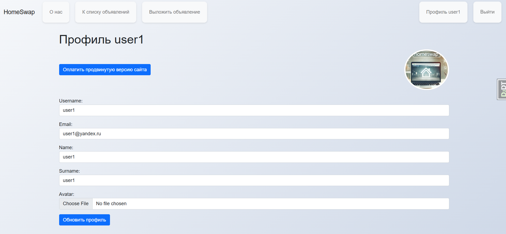
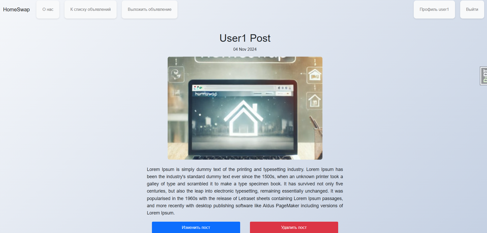
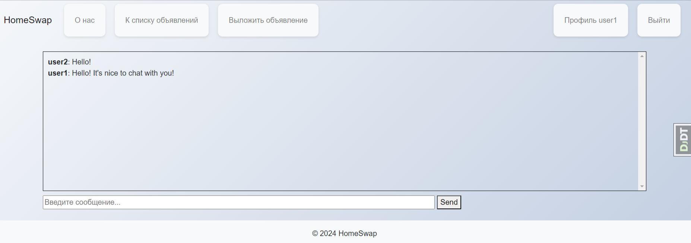
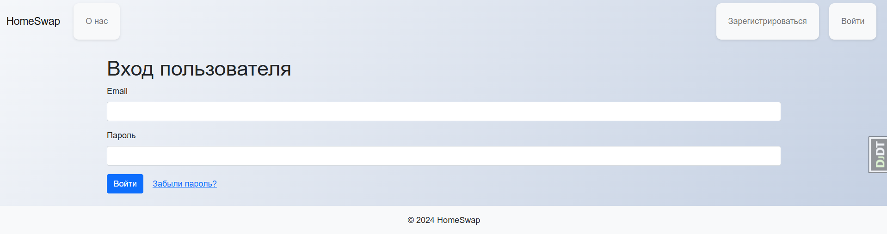
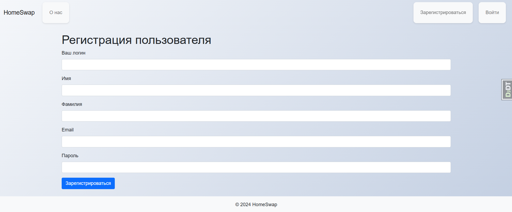
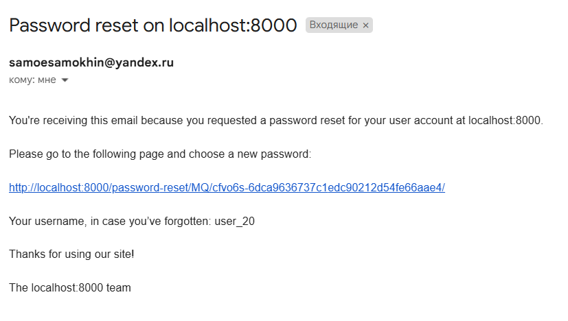
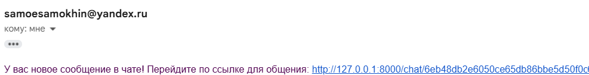
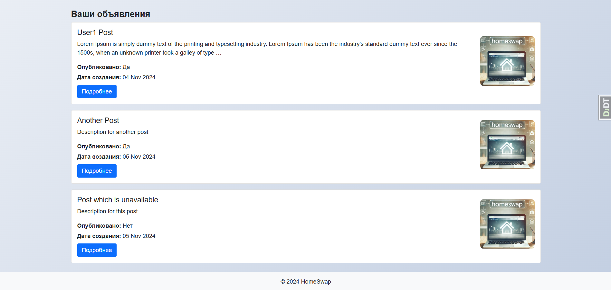

# 🏡 HomeSwap - Temporary Home Exchange Platform

**HomeSwap** is a platform that allows users to exchange their homes with others for a temporary period, such as vacations or business trips. The platform facilitates direct interaction between users, fosters trust-building, and organizes exchanges without intermediaries. **HomeSwap** is built on the principles of simplicity, security, and community-driven interaction.

---

## 🚀 Features

- **User Profiles**: Create and manage profiles with information about your home and availability.
  
- **Home Listings**: Post detailed information about your home, including pictures, descriptions, and exchange rules.
  
- **Real-Time Chat**: Communicate with potential home exchangers via an integrated chat system.
  
- **Secure Transactions**: Built-in trust verification and user authentication.
   
- **Registration**: Registration with JWT-tokens                                        
  
- **Password reset**: Using Mail                                       
  
- **Notifications**: Receive alerts about new home exchange requests and updates on ongoing transactions.
  
- **ElasticSearch implemented**                                                               
  

---

## 🛠️ Technologies Used

The project is developed using modern technologies to ensure high performance and scalability:

- **Backend**: Django & Django REST Framework (DRF)
- **Databases**:
  - **PostgreSQL** for core data
  - **MongoDB** for chat data storage
- **Caching**: Redis for session and cache management
- **Message Broker**: RabbitMQ for handling background tasks
- **Task Queue**: Celery for background task processing
- **Testing**: Unit tests to ensure code quality
- **Containerization**: Docker & Docker Compose for easy setup and deployment
- **API Gateway**: Nginx for API routing and load balancing
- **Monitoring**: ELK Stack (Elasticsearch, Logstash, Kibana) for log analysis and system monitoring

---

## 🔐 License

This project is licensed under proprietary terms.

© Pavel. All rights reserved.

This code is provided for viewing purposes only. No permission is granted to use, copy, modify, or distribute this code for any purpose, personal or commercial. Unauthorized use of this code is strictly prohibited.

---

## 📫 Contact

- **Email**: [pavelsamo555@gmail.com](mailto:pavelsamo555@gmail.com)
- **Telegram/WhatsApp**: [PavelBackendDev](https://t.me/PavelBackendDev)

Thank you for your interest in **HomeSwap**! Stay tuned for updates and improvements.
